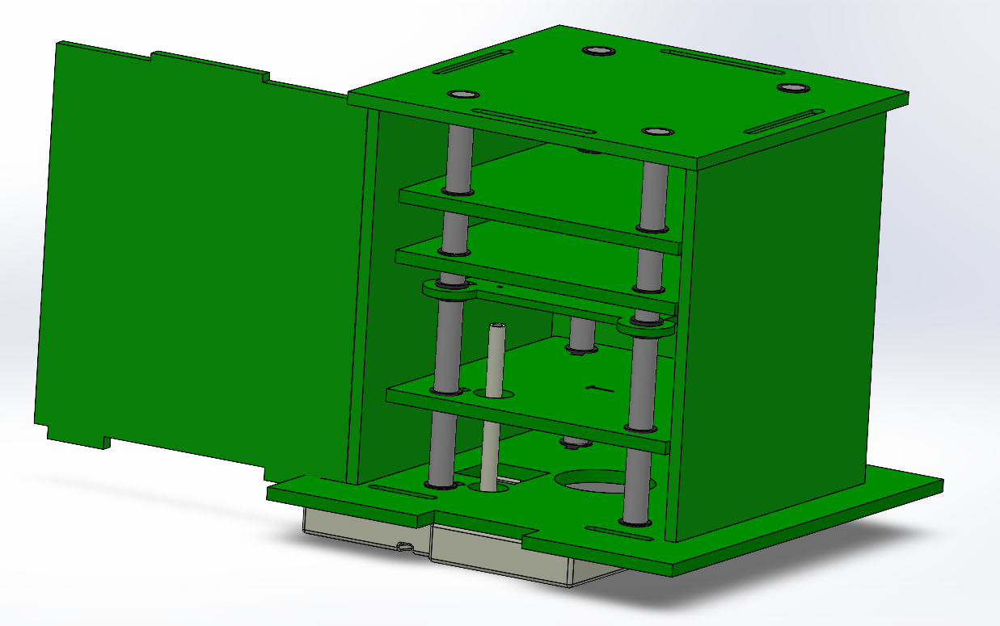
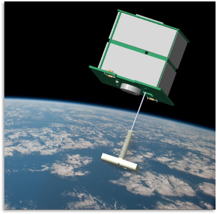
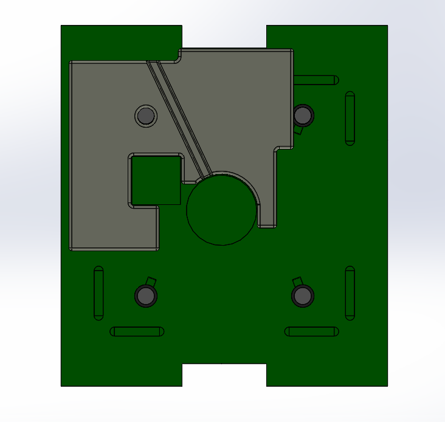
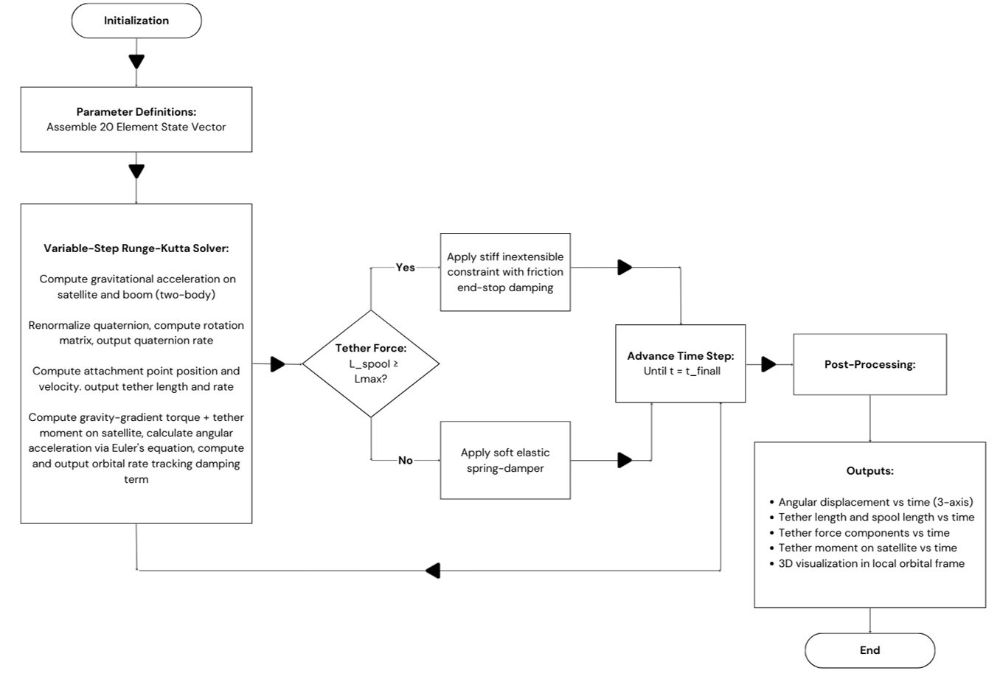
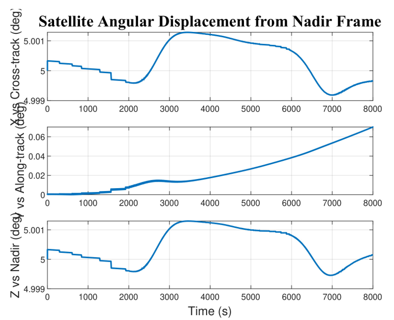
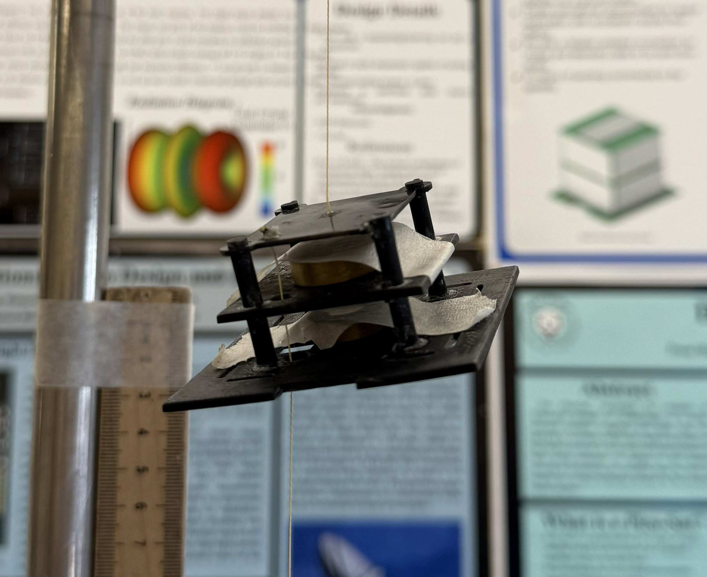
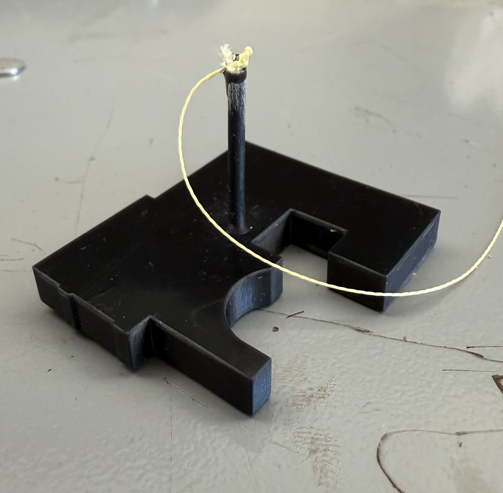
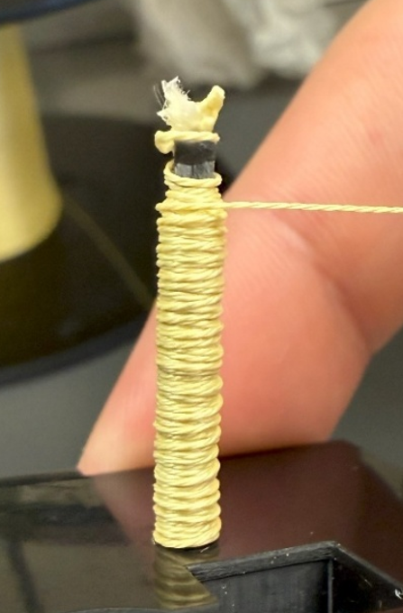
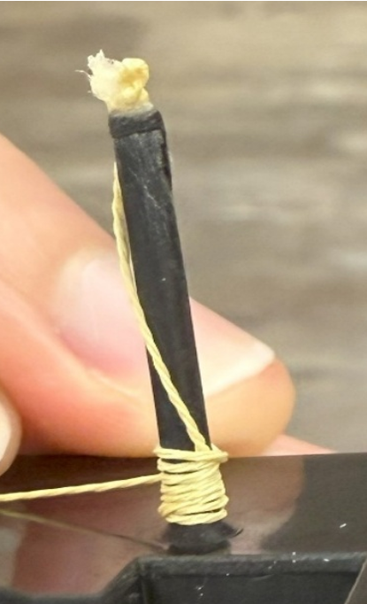
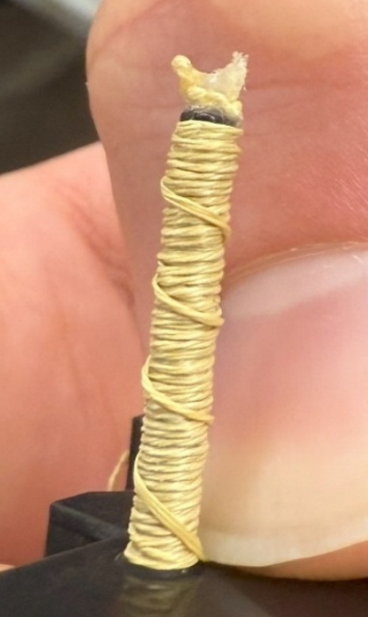

# PicoSatellite ADCS

Mechanical design, prototyping, and experimental validation of a deployable gravity-gradient boom system for a PocketQube satellite developed through the Wentworth PicoSat Initiative.

**3rd Place — 2026 AIAA Region I Student Conference**
I served as the primary author of the accompanying research paper, *Design and Validation of a Gravity-Gradient Boom Arm for Hybrid Attitude Control of a PocketQube Satellite*.

---

## Project Overview

The Wentworth PocketQube is an experimental Earth-imaging satellite designed around the severe mass, volume, and power constraints of the PocketQube platform.

The spacecraft uses a hybrid attitude control architecture combining passive gravity-gradient stabilization with active magnetic control. A tethered mass deploys from the spacecraft to increase its moment of inertia and generate a gravity-gradient restoring torque, while magnetorquers are intended to provide supplementary active control.

---

## My Contributions

My primary responsibilities focused on the mechanical design, prototyping, assembly, and experimental validation of the gravity-gradient deployment system. Additionally, I was the primary author of the paper and organized the execution of the project.

I was responsible for:

- Designing the gravity-gradient boom mass around the geometry and packaging constraints of the satellite baseplate
- Maximizing boom mass within the available volume while maintaining clearance around critical satellite components
- Positioning the boom mass center of mass near the deployment shaft axis to reduce unwanted rotational effects during deployment
- Designing a hollow 3D-printed experimental boom mass that could be filled with lead pellets for scaled testing
- Assembling the physical satellite mockup and deployment hardware
- Developing and conducting the tether deployment experiments
- Testing multiple tether spool configurations
- Evaluating deployment behavior and identifying sources of transient disturbance
- Refining the spool configuration to improve deployment consistency

I also contributed to basic MATLAB/Simulink development during the broader project.

The high-fidelity orbital dynamics simulation and simulation results presented in this repository were primarily developed by project teammate **Lucas Wing**.

---

## System Concept

*Concept rendering of the PocketQube with the gravity-gradient boom deployed. Extending the boom mass away from the spacecraft increases the system's moment of inertia and enables passive gravity-gradient stabilization. (this image is credited to another student at Wentworth)*

---

## Mechanical Design

### Gravity-Gradient Boom Mass

The boom mass was designed around the existing satellite baseplate and internal component layout.

The design required sufficient deployed mass to generate a useful gravity-gradient moment while remaining within the limited volume and mass budget of the PocketQube.

Additional design considerations included:

- Camera and light-sensor clearance
- PCB and component clearance
- Tether routing
- Deployment shaft location
- Center-of-mass alignment
- Rotational inertia
- PocketQube packaging constraints

Tungsten was selected for the flight design because its high density allowed approximately 100 g of mass to be concentrated within the available geometry.

The irregular geometry allows the mass to conform to the available baseplate area while avoiding interference with surrounding spacecraft components.

---

## Numerical Simulation

A high-fidelity numerical model was developed by **Lucas Wing** to evaluate the coupled dynamics of the satellite and tethered boom in low Earth orbit.

The simulation incorporated:

- Two-body orbital dynamics
- Quaternion-based attitude propagation
- Gravity-gradient torque
- Tether forces and moments
- Spring-damper tether behavior
- Variable-step Runge-Kutta integration
- LVLH attitude tracking

### Attitude Stabilization Results

The simulation demonstrated bounded gravity-gradient libration and maintained the primary nadir-pointing axes near their initial alignment throughout the 8,000-second simulation.

A small drift remained about the uncontrolled axis, supporting the hybrid architecture in which magnetorquers provide supplementary active attitude control.

---

## Experimental Validation

Numerical simulation was useful for predicting orbital behavior, but physical tether deployment introduced mechanical effects that were difficult to model accurately.

A scaled experimental system was therefore developed to investigate:

- Tether unspooling behavior
- Spool geometry
- Deployment consistency
- Transient tension disturbances
- Mechanical failure modes

I assembled the experimental satellite mockup and conducted the deployment testing using a suspended test configuration.

### Scaled Experimental Boom Mass

Manufacturing the experimental mass from tungsten was not practical for laboratory testing.

I designed a hollow 3D-printed version of the boom mass that could be filled with lead pellets. The resulting experimental mass was used with a proportionally scaled satellite mockup to preserve the approximate mass relationship between the spacecraft and deployed boom.

---

## Spool Design Iteration

One of the primary challenges identified during testing was controlling transient tether tension during deployment.

Multiple spool patterns were experimentally evaluated and refined.

<table>
<tr>
<td align="center"><b>Initial Alternating Pattern</b></td>
<td align="center"><b>Single-Direction Pattern</b></td>
<td align="center"><b>Transitional Pattern</b></td>
</tr>
<tr>
<td></td>
<td></td>
<td></td>
</tr>
</table>

### Initial Alternating Pattern

Alternating the winding direction between layers produced significant transient tension spikes and irregular deployment behavior.

### Single-Direction Pattern

Changing to a primarily single-direction winding strategy substantially improved deployment consistency and reduced tension disturbances.

### Transitional Pattern

Introducing controlled transitional winding between layers further reduced abrupt changes during unspooling and produced near-continuous steady-state deployment through most of the test.

This iterative testing demonstrated that **spool geometry was a major factor in reducing deployment-induced disturbances.**

---

## Key Results

The combined design, simulation, and experimental effort demonstrated that:

- A compact gravity-gradient mass could be integrated within the PocketQube's restrictive geometry
- Passive gravity-gradient stabilization produced bounded attitude behavior in simulation
- Physical spool geometry had a significant effect on deployment-induced disturbances
- Iterative spool redesign substantially improved tether deployment consistency
- A hybrid passive/active attitude-control architecture provides a promising approach for the PocketQube platform

---

## Tools & Engineering Skills

**Mechanical Design**
- SolidWorks
- Design for additive manufacturing
- Mass-property optimization
- Mechanical packaging
- Rapid prototyping

**Experimental Engineering**
- Prototype assembly
- Experimental test development
- Design iteration
- Failure-mode identification
- Qualitative deployment analysis

**Spacecraft Systems**
- Gravity-gradient stabilization
- Attitude control
- PocketQube architecture
- Tether deployment systems
- Spacecraft mass and volume constraints

**Computational Tools**
- MATLAB
- Simulink
- Numerical simulation fundamentals

---

## Research Paper

The complete AIAA Region I Student Conference paper is available in the [`Paper`](Paper/) directory:

**Design and Validation of a Gravity-Gradient Boom Arm for Hybrid Attitude Control of a PocketQube Satellite**

The paper contains the complete system design, numerical methodology, experimental procedure, results, discussion, and references.

---

## Future Development

Future development of the system includes:

- Flight-ready tungsten boom mass fabrication
- Magnetorquer integration
- Attitude determination using magnetometers or an IMU
- Higher-fidelity environmental perturbation modeling
- Microgravity or on-orbit deployment validation
- Further optimization of tether anchoring and spool geometry

---

## Acknowledgments

This project was completed collaboratively through the **Wentworth PicoSat Initiative**.

The orbital dynamics simulation and associated numerical results shown in this repository were primarily developed by **Lucas Wing**.

The research was presented at the **2026 AIAA Region I Student Conference** and awarded **Third Place**.
